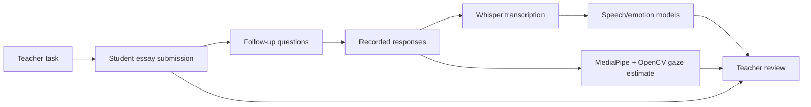

# IntellInspect

IntellInspect is a hackathon-era Django prototype exploring whether an essay-submission workflow could be paired with **interactive follow-up questions and multimodal behavioral signals** to help an educator inspect how well a student understands submitted work.

> **Status:** exploratory prototype. The gaze and speech/emotion features are experimental signals, **not validated detectors of cheating, deception, authorship, or competence**. They should never be used by themselves to make consequential academic-integrity decisions.

## What is implemented

- student and teacher roles attached to courses;
- task/question bank and submission persistence;
- essay submission plus generated/served follow-up questions;
- video/audio processing paths;
- OpenAI Whisper transcription;
- transformer-based speech-emotion scoring;
- MediaPipe/OpenCV gaze/head-pose estimation;
- teacher/student Django pages for viewing the workflow and results.

## Reviewer guide

The maintained application lives under `ICHACK_0/ichacksite/`.

| File | What it shows |
| --- | --- |
| [`ICHACK_0/ichacksite/ichacksite2/models.py`](ICHACK_0/ichacksite/ichacksite2/models.py) | courses, users, tasks, essay submissions, follow-up questions and stored analysis fields |
| [`ICHACK_0/ichacksite/ichacksite2/views.py`](ICHACK_0/ichacksite/ichacksite2/views.py) | transcription, emotion-model calls, gaze geometry, authentication and submission workflow |
| [`ICHACK_0/ichacksite/ichacksite2/access.py`](ICHACK_0/ichacksite/ichacksite2/access.py) | authenticated/teacher API guards and CSRF boundary added in the later cleanup pass |
| [`ICHACK_0/ichacksite/ichacksite2/templates/`](ICHACK_0/ichacksite/ichacksite2/templates/) | teacher/student product surfaces |
| [`ICHACK_0/ichacksite/ichacksite/settings.py`](ICHACK_0/ichacksite/ichacksite/settings.py) | Django configuration |
| [`requirements.txt`](requirements.txt) | original ML/web dependency stack |

The interesting engineering work is the integration of web workflow, video processing and multiple model signals. The project should **not** be interpreted as evidence that those signals are scientifically valid measures of competence.

## Conceptual flow



The prototype stores a `gazeSuspicion` value and a speech-derived `polarity` value alongside the submission. Those names reflect the original hackathon framing; they are **heuristic prototype features**, not calibrated probabilities or reliable evidence of misconduct.

## Local setup

```bash
python -m venv .venv
# Windows: .venv\Scripts\activate
# Unix/macOS: source .venv/bin/activate
pip install -r requirements.txt
cp .env.example .env
cd ICHACK_0/ichacksite
python manage.py migrate
python manage.py runserver
```

The OpenAI SDK reads its normal `OPENAI_API_KEY` environment variable for transcription/model calls. The Django secret is also environment-configured rather than embedded in source.

## Repository layout

```text
ICHACK_0/ichacksite/
  manage.py
  ichacksite/          Django project settings/URLs
  ichacksite2/
    access.py          authentication/role/CSRF wrappers
    models.py
    views.py
    templates/
    static/
    migrations/
requirements.txt
```

## Methodological limitations

Several parts of the original prototype are useful demonstrations but would need major redesign before research or educational deployment:

- **Gaze is not intent.** Looking away from a screen can have many benign causes and is affected by camera geometry, disability, environment and task style.
- **Emotion classifiers are not competence detectors.** Off-the-shelf text-emotion models do not establish uncertainty, dishonesty or authorship.
- **Repeated transcription is not uncertainty calibration.** Taking several stochastic Whisper transcriptions does not by itself produce a principled confidence estimate.
- **Hand-designed score combinations are uncalibrated.** The speech-derived `polarity` formula has not been validated against labelled outcomes.
- **Sensitive data:** essays, video, voice, gaze and educational records require explicit consent, minimisation, retention controls and access restrictions.
- **Fairness/accessibility:** neurodivergence, disability, language, accent and cultural differences could strongly affect behavioral signals.

## Engineering limitations

- the original view functions still contain hackathon-era `csrf_exempt` decorators, but the maintained URL surface now wraps routed JSON/submission endpoints in normal CSRF validation and authentication; teacher data endpoints additionally require a teacher or superuser role;
- model, video-processing and HTTP concerns are concentrated in `views.py`;
- the repository has effectively no automated behavioral test suite;
- OpenCV UI/debug behavior is mixed into server-side processing;
- some exception handling and data validation are prototype-grade;
- the original committed development database/runtime caches have been removed from the maintained source tree.

## What I would improve now

I would first remove any notion of an automatic “suspicion” score. Instead, I would make the system an **evidence viewer**: generate content-grounded oral follow-up questions, record answers with consent, show exact transcript/question evidence to the educator, and evaluate factual consistency using a transparent rubric. Technically, I would extract media/model processing into typed services, schema-validate model output, add deterministic fixtures and tests, and define a deletion/retention policy for uploaded media.

## Historical note

This repository is retained as an early hackathon prototype. It is not one of the primary coding samples in this account; newer repositories demonstrate more mature testing, provenance and evaluation practices.
